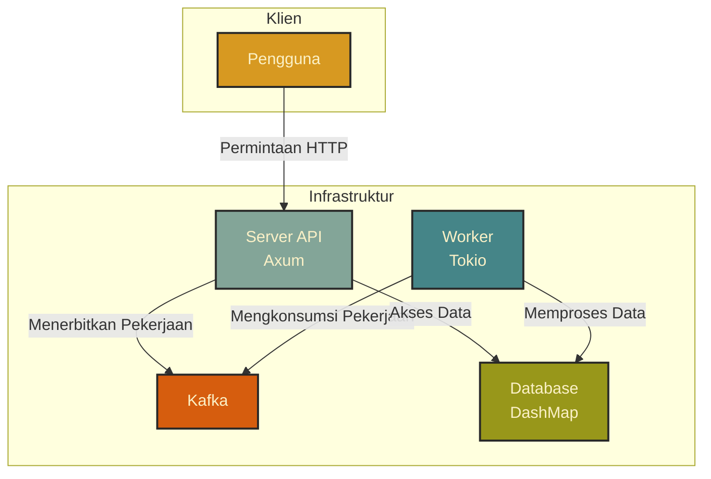

# ⚡ Contoh CRUD Asinkron dengan Tokio (I/O bound) + Rayon (CPU bound) + Kafka

Sistem CRUD dalam memori yang sederhana dan berkinerja tinggi menggunakan **Rust**, **Axum**, **DashMap**, **Tokio**, dan **Rayon**.

## 📦 Fitur
- API RESTful dengan Axum
- Penyimpanan dalam memori menggunakan DashMap
- Dukungan impor/ekspor CSV
- I/O Asinkron dengan Tokio
- Pemrosesan paralel dengan Rayon
- Komunikasi berbasis peristiwa dengan Kafka

## 🚀 Cara Penggunaan

### 1. Prasyarat
- [Rust](https://www.rust-lang.org/tools/install)
- [Docker](https://docs.docker.com/get-docker/) (untuk menjalankan Kafka)

### 2. Instalasi
1.  Clone repositori ini:
    ```bash
    git clone https://github.com/MamangRust/example-async-tokio-rayon-dashmap-pararel-worker-kafka.git
    cd example-async-tokio-rayon-dashmap-pararel-worker-kafka
    ```
2.  Jalankan Kafka menggunakan Docker Compose:
    ```bash
    docker-compose up -d
    ```

### 3. Menjalankan Aplikasi
Aplikasi ini memiliki dua mode: `server` dan `worker`.

*   **Menjalankan Server API:**
    ```bash
    make run-server
    ```
    Server akan berjalan di `http://0.0.0.0:5000`.

*   **Menjalankan Worker:**
    ```bash
    make run-worker
    ```
    Worker akan terhubung ke Kafka dan memproses pekerjaan.

## 🏛️ Arsitektur

Diagram berikut mengilustrasikan arsitektur aplikasi:



### Penjelasan Komponen

*   **Server API (Axum):** Bertanggung jawab untuk menerima permintaan HTTP dari klien, melakukan validasi, dan meneruskan permintaan ke `UserService`. Untuk tugas-tugas yang membutuhkan banyak waktu, server akan menerbitkan pesan ke **Kafka**.
*   **Worker (Tokio):** Berjalan sebagai proses terpisah yang mendengarkan topik di **Kafka**. Ketika pesan baru diterima, worker akan memprosesnya secara asinkron.
*   **Kafka:** Bertindak sebagai perantara pesan antara *server* dan *worker*, memastikan bahwa tugas-tugas yang membutuhkan banyak waktu tidak memblokir *thread* utama server.
*   **Database (DashMap):** Berfungsi sebagai penyimpanan data dalam memori yang aman untuk *thread*.
*   **Rayon:** Digunakan untuk pemrosesan data secara paralel yang intensif CPU, seperti saat mengimpor data dari file CSV.